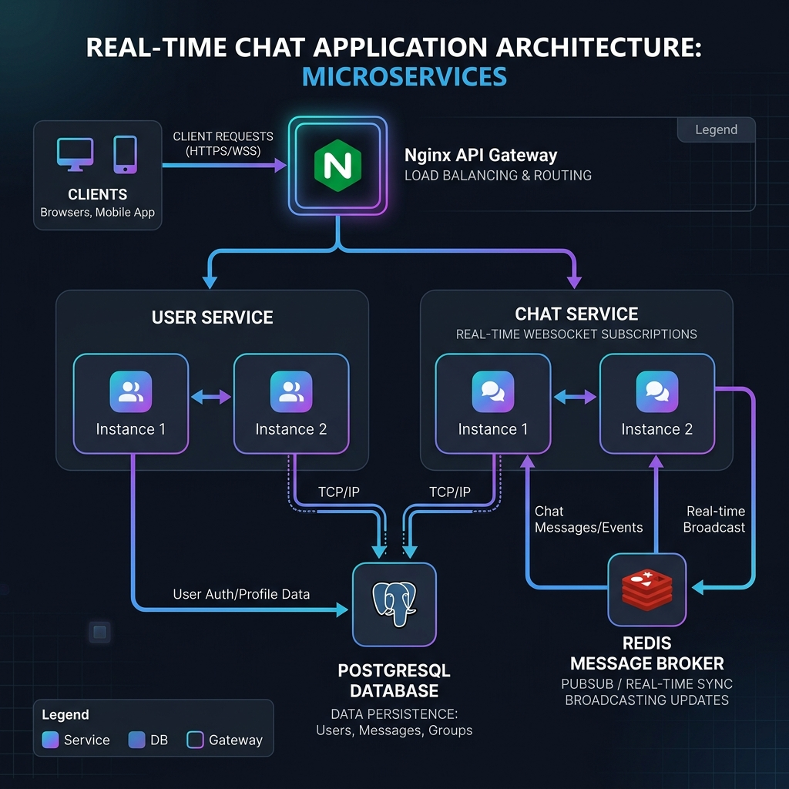
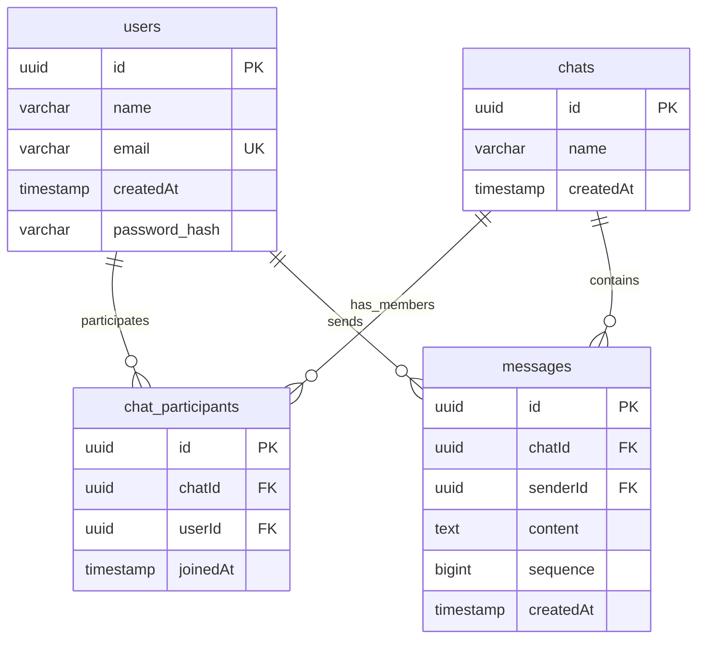
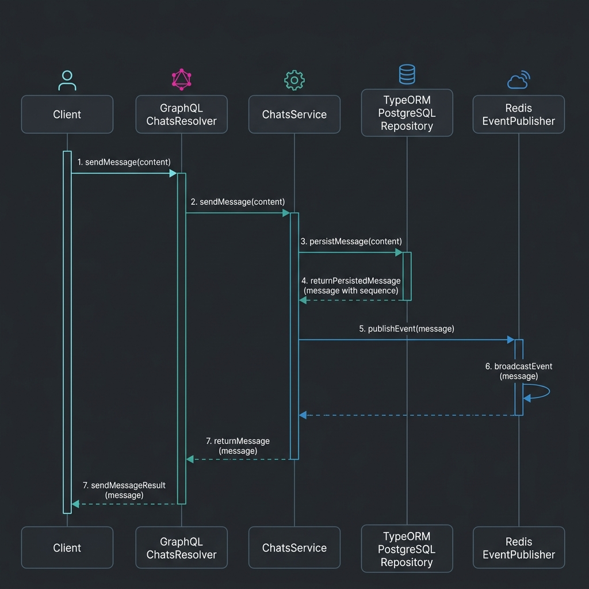

# Real-Time Horizontally Scalable Chat Monorepo

This repository contains a containerized, horizontally scalable real-time chat application built using a microservices-inspired architecture.

---

## 1. High-Level Design (HLD)

### System Architecture Diagram
The system uses an **Nginx Gateway** as a single entry point (port `8000`), routing path-based HTTP requests and WebSocket connections to load-balanced service instances. Inter-service real-time communication is coordinated via a **Redis PubSub** broker.



### Core Architecture Components
1. **Nginx API Gateway**:
   - Exposed on host port `8000`.
   - Routes `/user-service/graphql` internally to either `user-service-1` or `user-service-2`.
   - Routes `/chat-service/graphql` (HTTP and WS WebSocket subscriptions) internally to either `chat-service-1` or `chat-service-2`.
2. **User Service (Explicit segregated instances)**:
   - Manages user profiles, password hashing, and authentication.
3. **Chat Service (Explicit segregated instances)**:
   - Manages chat rooms, memberships, and message persistence.
   - Publishes events to the Redis PubSub broker to synchronize messages in real-time across load-balanced instances.
4. **PostgreSQL Database & Redis Broker**:
   - Stores user and message history persistently (utilizing a sequence generator for message order).
   - Redis acts as a message broker for cross-replica sync.

---

## 2. Low-Level Design (LLD)

### Database Entity Relationship Model
The database consists of 4 main tables mapped using TypeORM:



* **Strict Message Ordering (`sequence`)**: The `messages` table contains a database-generated `bigint` auto-incrementing column (`sequence`). Even when messages are sent in parallel across different load-balanced instances, the Postgres sequence generator acts as a central coordinator, guaranteeing a deterministic ordering. A TypeORM transformer converts the 64-bit database bigint into a JavaScript number for the API.

---

### Backend Service Design & Dependency Injection (DIP)
Both services strictly implement the **Dependency Inversion Principle (DIP)**. Code depends on abstract interfaces, not concrete implementations. Concrete adapters are bound to injection tokens at the module level.

#### Example Component Structure (`chat-service`):
* `IMessageRepository`: Interface defining persistence operations.
* `TypeOrmMessageRepository`: Concrete TypeORM implementation.
* `IEventPublisher`: Interface defining PubSub broker publishing.
* `RedisEventPublisher`: Concrete implementation wrapping `graphql-redis-subscriptions`.

#### Persist-Then-Publish Pattern:
When a message is sent, the operations occur in a strict sequential order:


---

### React Frontend Client Design
The frontend is a HTML5 / CSS3 / React SPA leveraging Apollo Client:
1. **Separation of Concerns & Hook Encapsulation**: Presentational views in [App.tsx](file:///Users/gabru/Desktop/rtcs/frontend/src/App.tsx) are fully decoupled from Apollo state operations by using custom encapsulating hooks:
   - [useUsers.ts](file:///Users/gabru/Desktop/rtcs/frontend/src/hooks/useUsers.ts): Encapsulates user sign-up, login, and user queries.
   - [useChats.ts](file:///Users/gabru/Desktop/rtcs/frontend/src/hooks/useChats.ts): Encapsulates chat room actions, history loading, message sending, and real-time subscription notifications.
2. **Component-Scoped Structure (TSX & CSS Chunking)**:
   - To maximize modularity and maintainability, components are organized into isolated directories containing both their logic (`.tsx`) and styling (`.css`) side-by-side. 
   - This prevents global CSS pollution, ensures each component focuses on a single responsibility, and keeps all UI files lightweight (strictly under 100 lines of code).
3. **Session Persistence**: User sessions (user profile metadata) are stored in `localStorage` upon login/registration. If the page is reloaded, the app restores the session automatically.
4. **UI Enhancements**: Exposes eye-icon buttons next to password inputs to toggle password visibility. Maps sender IDs to actual user names.

---

## 3. How to Run the Project (Docker Compose Mode)

By default, the stack starts up with **2 load-balanced instances** for both `user-service` and `chat-service` out-of-the-box using standard Docker Compose. Nginx handles internal routing via round-robin upstream definitions.

### Prerequisites

1. **Docker & Docker Compose**:
   - You must have **Docker** and **Docker Compose** installed to run this project.
   - If not installed, download it from the official website: [Docker Desktop Installation Guide](https://docs.docker.com/get-docker/).
   - Verify your installation by running:
     ```bash
     docker --version
     docker compose version
     ```

2. **Host Port Requirements**:
   Ensure the following ports are **not already in use** by other services running directly on your host machine (such as a local PostgreSQL or Redis background daemon):
   * **`8000`** (Nginx Gateway Entrypoint)
   * **`5432`** (PostgreSQL Database)
   * **`6379`** (Redis Message Broker)

### Step 1: Start the Services
Run the following command from the root directory to build and start all containers:
```bash
docker compose up -d --build
```

### Step 2: Access the Application
* **Frontend Dashboard**: Open [http://localhost:8000](http://localhost:8000) in your browser.
* **User Service GraphQL Playground**: Navigate to [http://localhost:8000/user-service/graphql](http://localhost:8000/user-service/graphql).
* **Chat Service GraphQL Playground**: Navigate to [http://localhost:8000/chat-service/graphql](http://localhost:8000/chat-service/graphql).

### Step 3: Verify Healthchecks
* **User Service Health**: Check [http://localhost:8000/user-service/health](http://localhost:8000/user-service/health) to verify Postgres connection health.
* **Chat Service Health**: Check [http://localhost:8000/chat-service/health](http://localhost:8000/chat-service/health) to verify Postgres and Redis connection health.

### Step 4: Stop the Services
To shut down the containers:
```bash
docker compose down
```

---

## 4. Running the Tests

To run the unit, integration, and E2E test suites locally inside the service directories:
```bash
# User Service Unit Tests
cd backend/user-service && npm run test

# Chat Service Unit, Integration, & E2E Tests
cd ../chat-service
npm run test              # Unit Tests
npm run test:integration  # Real PG/Redis Integration Tests
npm run test:e2e          # E2E GraphQL API Tests
```

---

## 5. Architecture & Design Choices (Justification)

This monorepo implements a highly decoupled, horizontally scalable system designed with the following justifications:

1. **API Gateway Design (Nginx)**:
   - We utilize a single Nginx gateway binding to port `8000`. This shields the internal microservices from the client, simplifies path-based HTTP/WS routing, and load-balances traffic evenly using round-robin distribution to backend service instances.
2. **NestJS Framework & SOLID Principles**:
   - NestJS provides a robust dependency injection container. This is heavily leveraged to implement the **Dependency Inversion Principle (DIP)**. Service interfaces are decoupled from concrete database (TypeORM) and event-broker (Redis) adapters, making the application code modular and highly auditable.
3. **Monotonic Message Ordering (PostgreSQL Sequence)**:
   - Real-time chat requires messages to render in the exact order they were sent. When running multiple backend instances, messages arriving simultaneously on different instances could cause race conditions if they relied on database timestamps.
   - We solved this by using a PostgreSQL-managed `bigint` sequence column. PostgreSQL coordinates this central sequence atomically, guaranteeing a deterministic, monotonic ordering for all messages.
4. **Frontend Architecture & Modular Subcomponent Design**:
   - Rather than keeping a single monolithic `App.tsx` component, we decomposed the interface into small, independent subcomponents (all strictly under 100 lines: `AuthForm`, `SidebarHeader`, `CreateChatBar`, `ChatList`, and `ChatWindow`).
   - This significantly increases code readability and testability, allows developers to immediately understand each component's single responsibility, and simplifies component-level state changes.
5. **Class-Based CSS Styling & Scoped Stylesheets**:
   - We strictly avoid inline CSS styles across our React components, separating presentation styles into component-scoped stylesheets (`.css` files located side-by-side with their corresponding `.tsx` files).
   - This ensures a clean **Separation of Concerns**, keeps the TSX templates lightweight, and improves performance by allowing the browser to parse and cache static stylesheets efficiently.
6. **Redis Chat History Caching (Cache-Aside & Write-Through)**:
   - To mitigate database read latency and reduce Postgres load when switching chat rooms, we cache the most recent 50 messages of active chat rooms in Redis.
   - We use a **Write-Through** approach (appending to the Redis list and trimming it to 50 items on new messages) and a **Cache-Aside** approach (querying Redis list on connection, falling back to PostgreSQL, and backfilling Redis). Caching is resilient: Redis failures are caught gracefully, falling back to direct database reads without failing client API calls.

---

## 6. Testing Approach

To prove the stability of the application, we implement a layered testing strategy:

1. **Unit Tests (Isolation)**:
   - Target individual service business logic (e.g., `users.service.ts` or `chats.service.ts`) using Jest. All external repositories, databases, and PubSub dependencies are completely mocked, ensuring tests run in milliseconds.
2. **Integration Tests (Database & Cache Sync)**:
   - Target database queries and Redis PubSub synchronizations in-process (e.g. `chats.integration.spec.ts`). These connect to real PostgreSQL and Redis containers to verify the persist-then-publish sequence and subscriber message events.
3. **End-to-End Tests (API Operations)**:
   - Target the live REST and GraphQL endpoints (e.g. `graphql.e2e-spec.ts`). We use `supertest` to dispatch GraphQL mutations and queries against the NestJS application pipeline, asserting exact schema validation, database mutations, and unauthorized exception handling.

---

## 7. Trade-offs & Limitations

### 1. Redis Pub/Sub vs. Redis Streams
We explicitly chose **Redis Pub/Sub** instead of **Redis Streams** for active client synchronization:
* **Redis Streams**: A durable, persistent append-only log. It keeps a history of messages in memory and requires managing read offsets, stream lengths (trimming), and consumer group states.
* **Redis Pub/Sub & List Cache**: We combine Redis Pub/Sub (lightweight, transient "fire-and-forget" broadcasting of new messages) with a Redis List-based cache (capping active rooms to their most recent 50 messages).
* **The Choice**: In our architecture, **PostgreSQL is the ultimate source of truth for message history**. For initial loads, the frontend pulls the hot 50 messages from the Redis cache. For historical page scrolling (cold data), it queries PostgreSQL. Using Redis Streams would add a redundant, high-memory persistent broker layer, increasing complexity without architectural benefits. Our Pub/Sub + Capped List strategy provides low-overhead, concurrent-safe performance while PostgreSQL guarantees total data durability.

### 2. Database Constraint Lock
* Using a Postgres sequence coordinates message order, but it creates a central locking constraint on the PostgreSQL instance. At extreme global scale (millions of writes per second), this would become a bottleneck. Under such workloads, a distributed ID generation system like **Snowflake IDs** or **ULIDs** (Lexicographically sortable UUIDs) would be adopted.

### 3. Nginx Static Upstreams
* Nginx routing is statically defined inside `nginx.conf` (`user-service-1`, `user-service-2`). In a dynamic cloud production environment, we would replace this static configuration with a dynamic Service Registry/Discovery pattern (like Consul, Consul-template, or Eureka) to support auto-registering backend instances.

